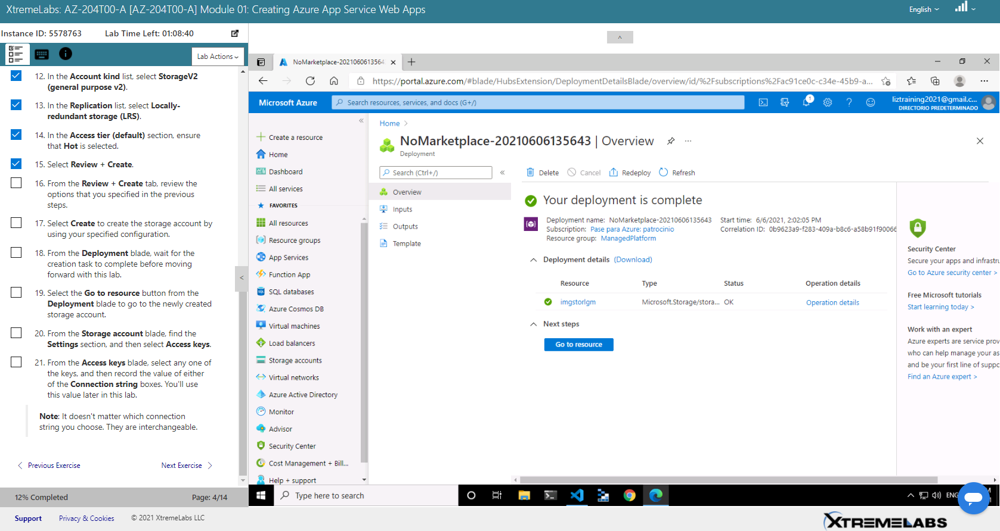
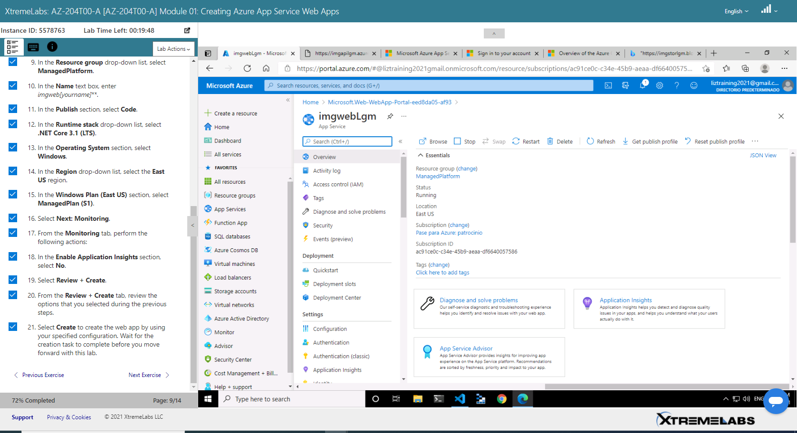
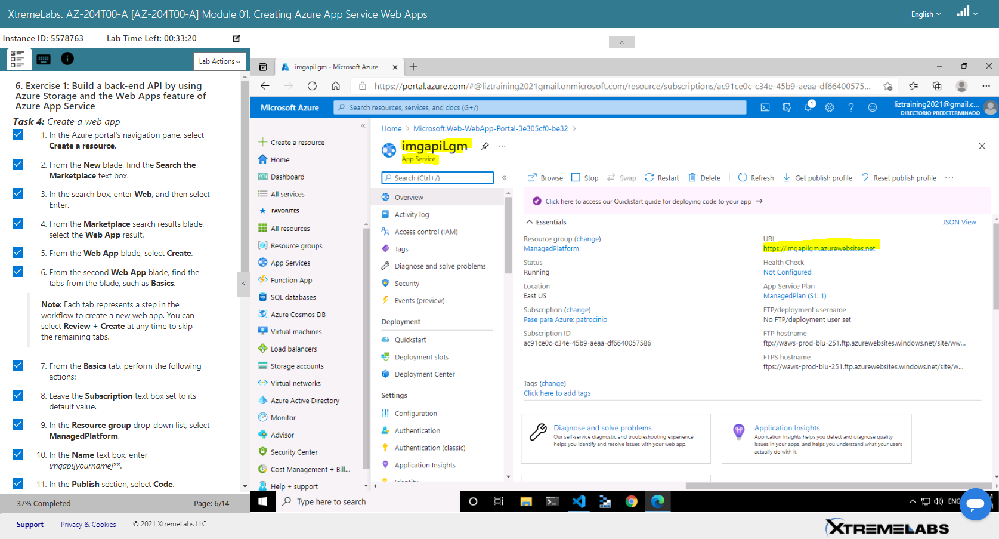
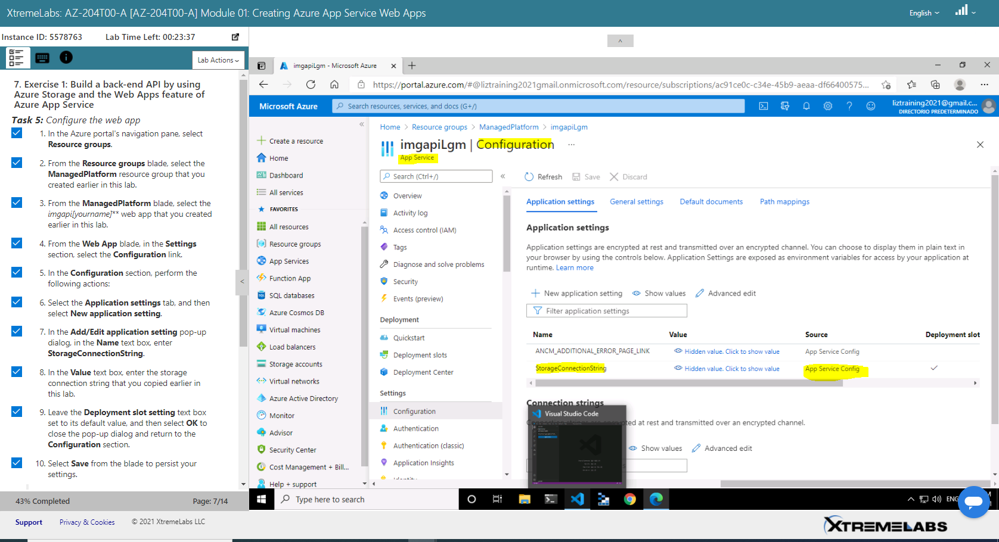
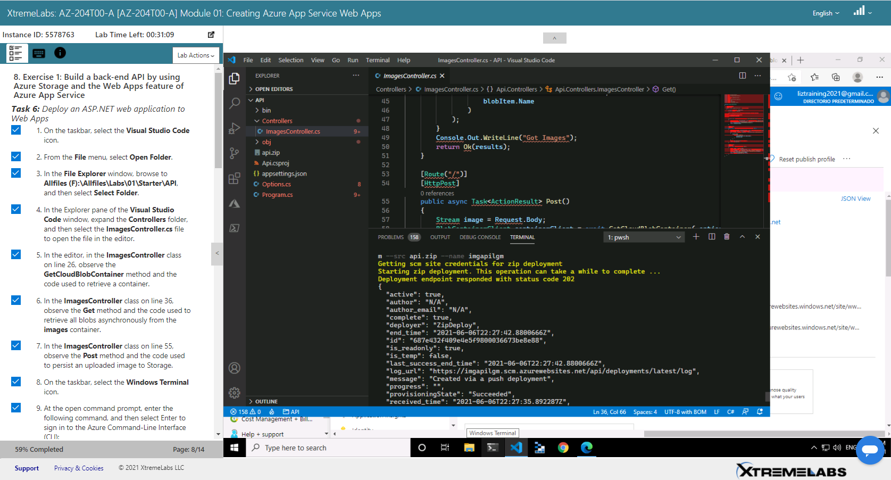

## Alumno: Lizbeth Gómes Monserratte

# Modulo 1 Creating a web app by using the Azure portal    

### Build a back-end API by using Azure Storage and the Web Apps feature of Azure App Service

## Build a front-end web application by using Azure Web Apps

imgstorlgm 

#### Access keys

6OXbgVeXctaLAs/Bqr7txqtEG92KxWJg1l12Di112KRHyr/aEy0ydhDsofZBf2Eypg+RLXGZNgtP3EXHKE8yNA==

#### Connection string

DefaultEndpointsProtocol=https;AccountName=imgstorlgm;AccountKey=6OXbgVeXctaLAs/Bqr7txqtEG92KxWJg1l12Di112KRHyr/aEy0ydhDsofZBf2Eypg+RLXGZNgtP3EXHKE8yNA==;EndpointSuffix=core.windows.net

#### URL

https://imgapilgm.azurewebsites.net

az webapp deployment source config-zip --resource-group ManagedPlatform --src api.zip --name imgapilgm

az webapp deployment source config-zip --resource-group ManagedPlatform --src web.zip --name imgwebLgm

# [Volver >>>](https://github.com/liztraining2021/CFTICIFCD3820611/blob/master/ContenidoEvidenciasAZ-204.md)

