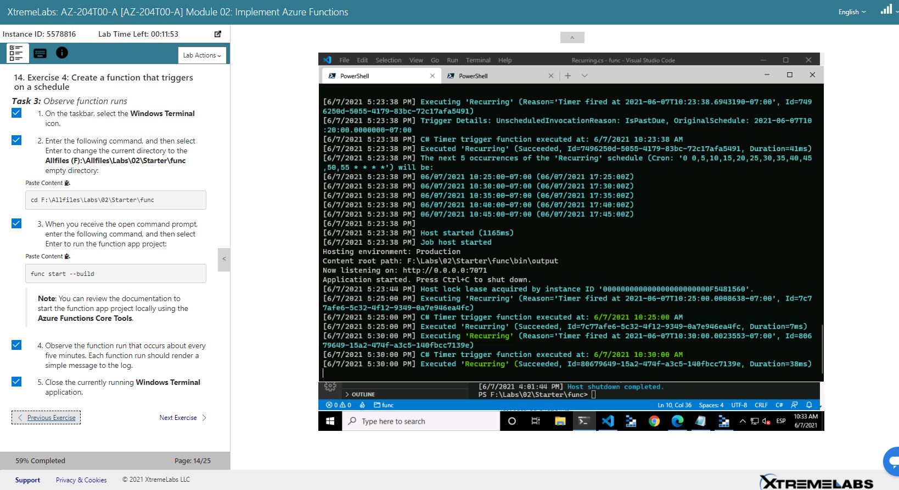

## Alumno: Lizbeth Gómes Monserratte

# Modulo 2 - Create an HTTP trigger function by using  the Azure portal

###  Implement Azure Functions

### Storage account name

​	funstorlgm

### Conection String

DefaultEndpointsProtocol=https;AccountName=funcstorlgm;AccountKey=Mq473aEXFvjm5hqTeROm23JAPgNGzAOoqbuXDBPMcG9QN2QKKxUN8wZrjMoOJfJe2IL7is0w5OCfOKRNPhs/gA==;EndpointSuffix=core.windows.net;

### Exercise 2 - Configure a local Azure Functions project

### Exercise 3: Create a function that's triggered by an HTTP request

### Http Functions:

        Echo: [POST] http://localhost:7071/api/Echo

### Exer6-1a-DeployLocalFunctionProjectToAzureFunctionsCoreTools

### Exer7-1a-Clean up your subscriptions

# [Volver >>>](https://github.com/liztraining2021/CFTICIFCD3820611/blob/master/ContenidoEvidenciasAZ-204.md)

