## Alumno: Lizbeth Gómes Monserratte

# Modulo 3 - Develop solutions that use blob storage

# Create a block blob storage accountMod 

####  Exercise 1: Create Azure resources

**Task 2:** Create a Storage account

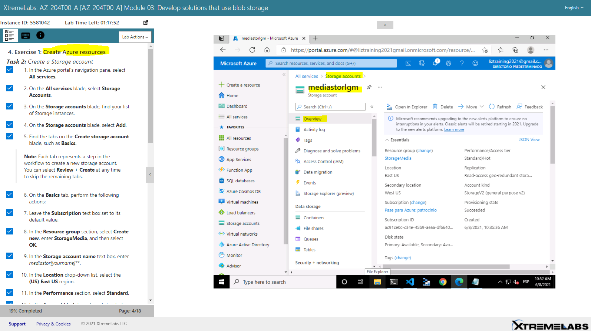

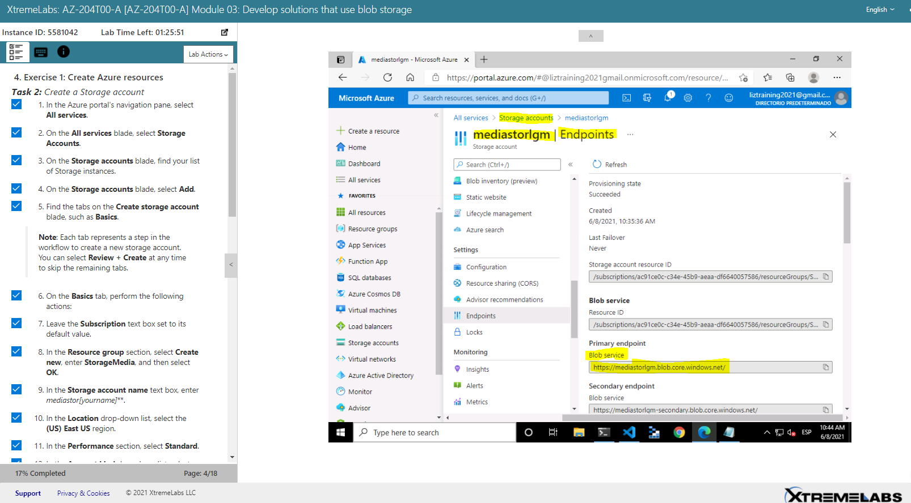

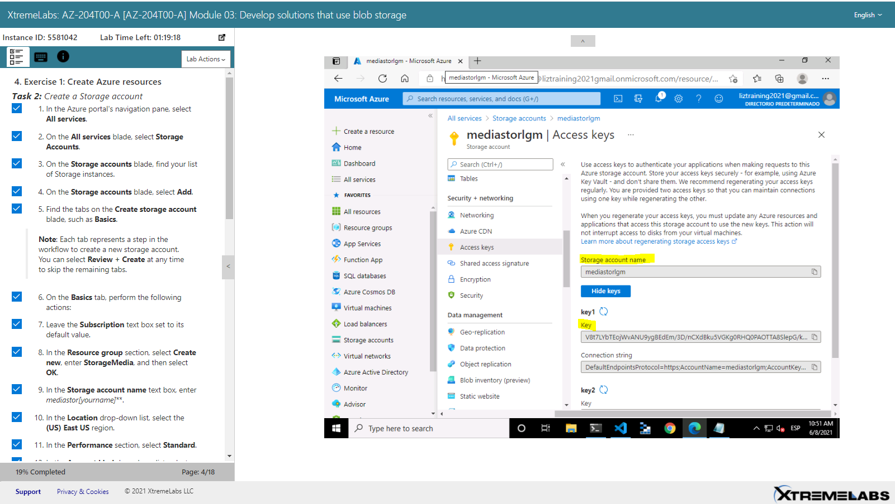

#### Exercise 2: Upload a blob into a container

**Task 1:** *Create storage account containers*

**Primary endpoint:  Blob service** : https://mediastorlgm.blob.core.windows.net/

**Key: **

V8t7LYbTEojWvANU9ygBEdEm/3D/nCXdBku5VGKg0RHQ0PAOTTA8SlepG/kj8MFsNDYKtdg5cw5N8343exV0kg==

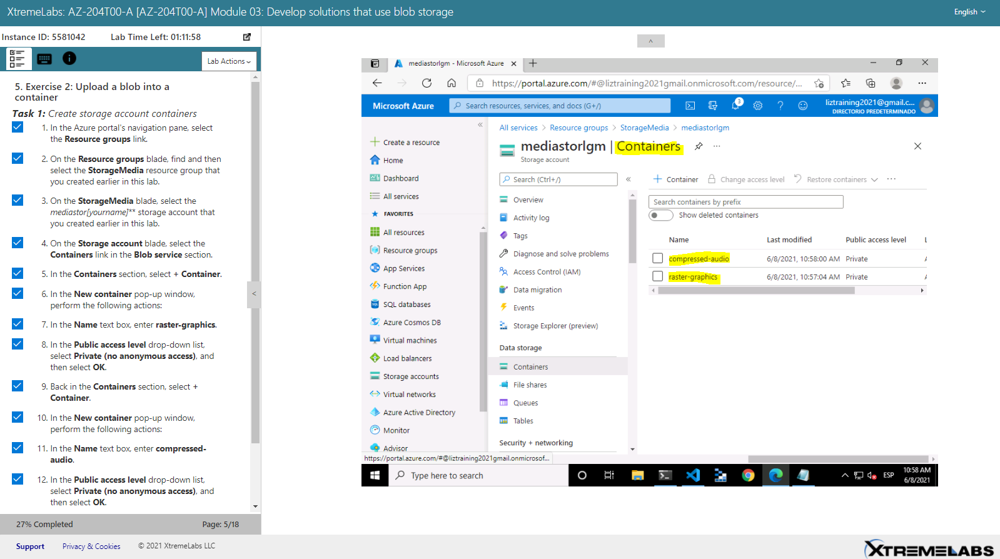

**Task 2:** *Upload a storage account blob*

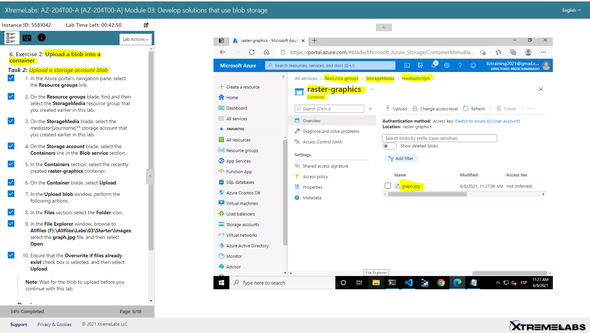

#### Exercise 3: Access containers by using the .NET SDK

**Task 1:** *Create .NET project*

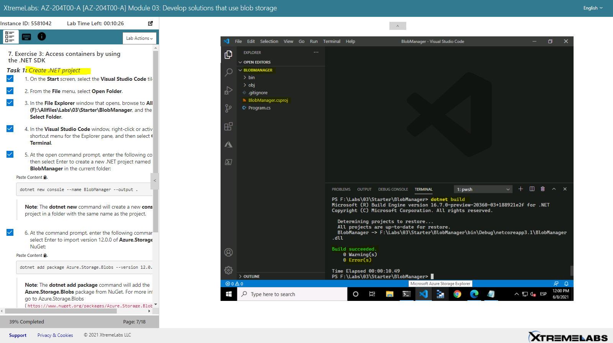

**Task 2:** Modify the Program class to access Storage

‌‌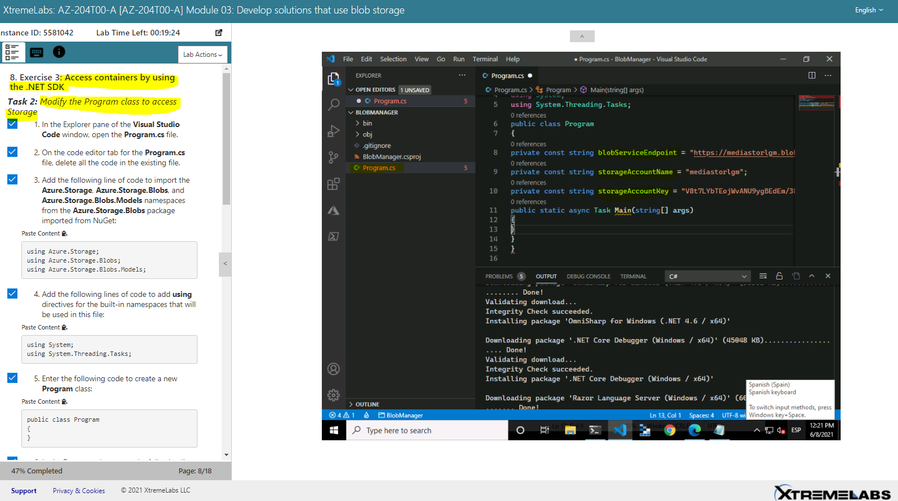

**Task 3:** Connect to the Azure Storage blob service endpoint

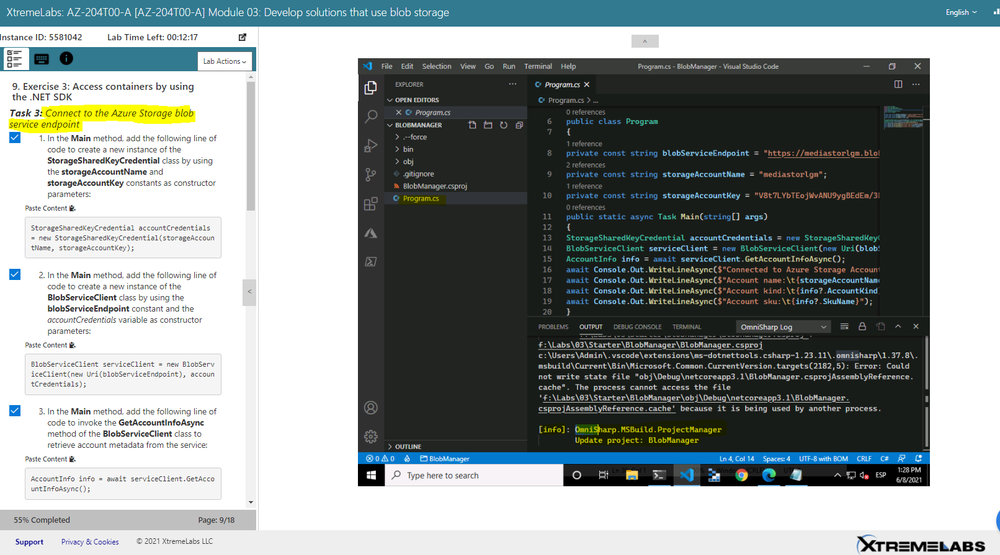

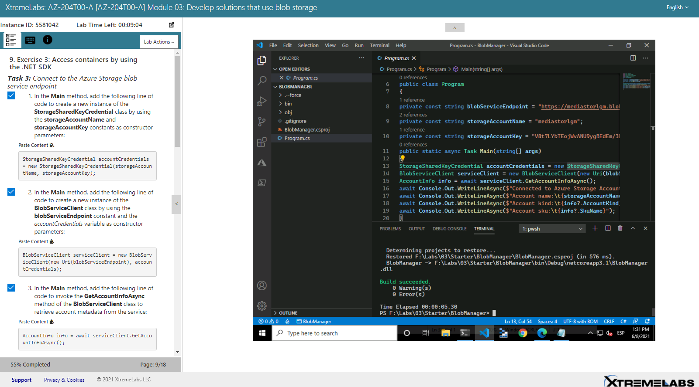

**Task 4:** *Enumerate the existing containers*

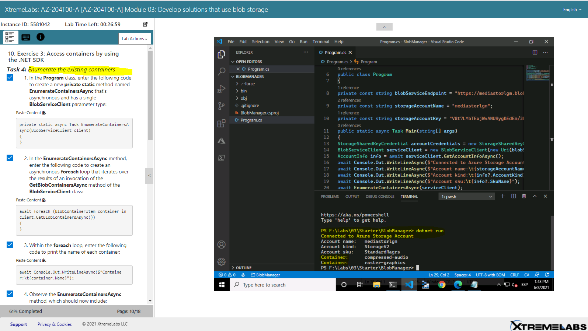

#### Exercise 4: Retrieve blob Uniform Resource Identifiers (URIs) by using the .NET SDK

**Task 1:** Enumerate the blobs in an existing container by using the SDK

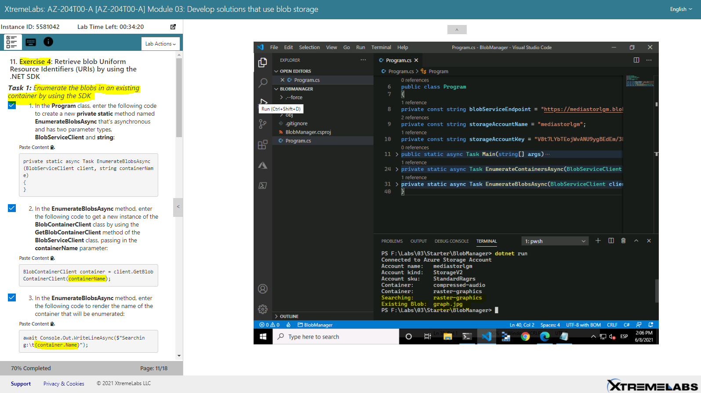

**Task 2:** *Create a new container by using the SDK*

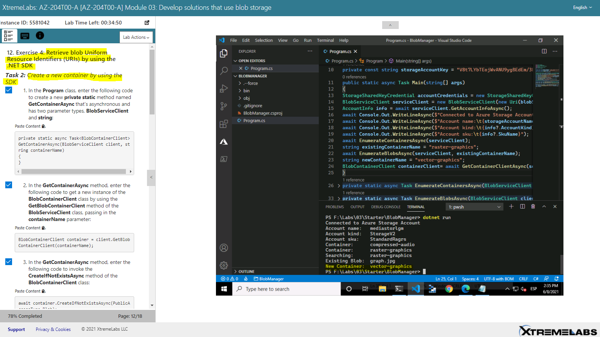

**Task 3:** *Upload a new blob by using the portal*

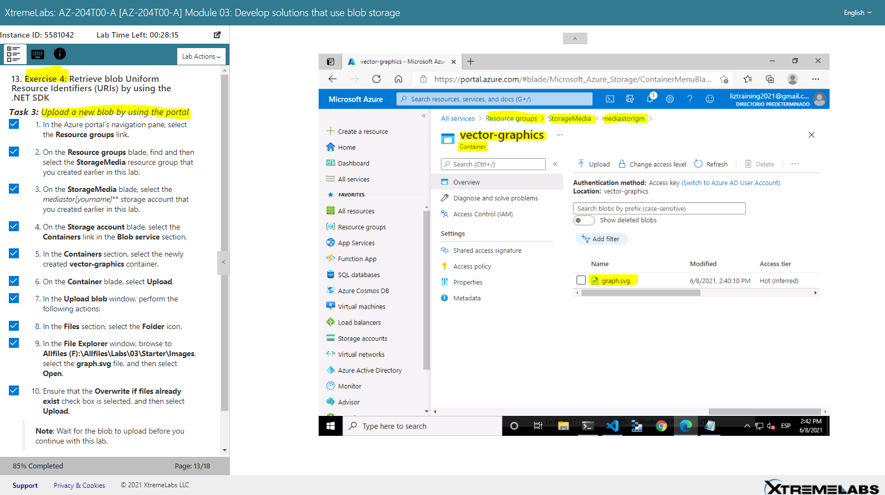

**Task 4:** *Access blob URI by using the SDK*

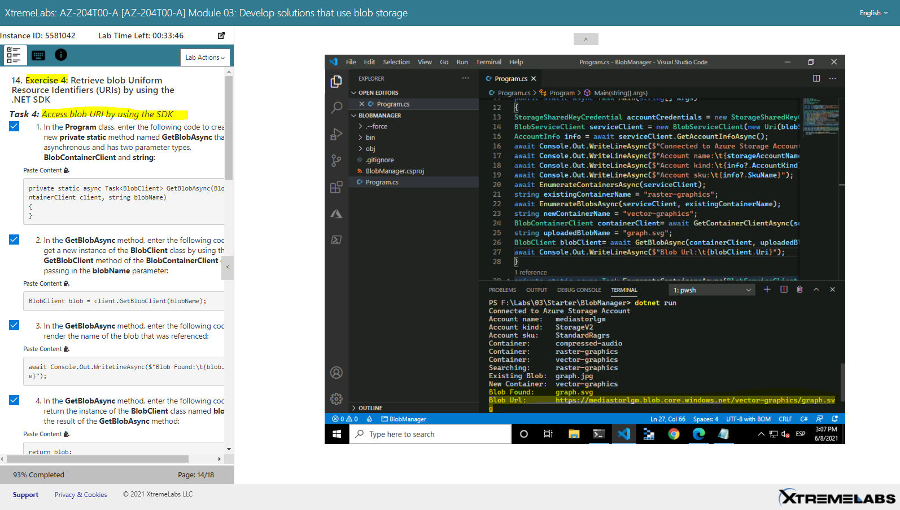

**Task 5:** *Test the URI by using a browser*

[mediastorlgm.blob.core.windows.net](https://mediastorlgm.blob.core.windows.net/vector-graphics/graph.svg)

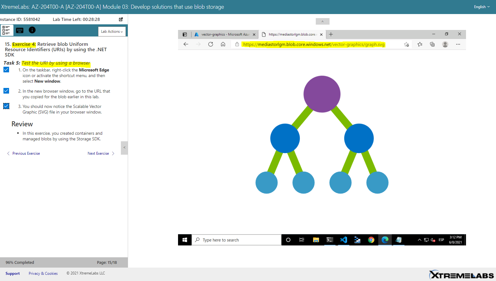

#### Exercise 5: Clean up your subscription

**Task 1:** Open Azure Cloud Shell and list resource groups

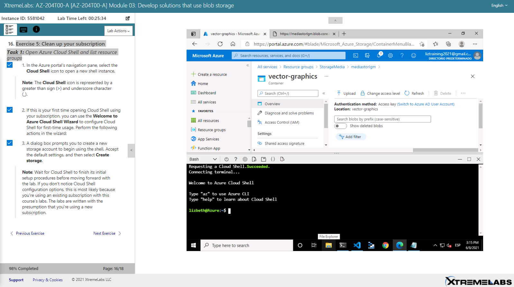

**Task 2:** *Delete a resource group*

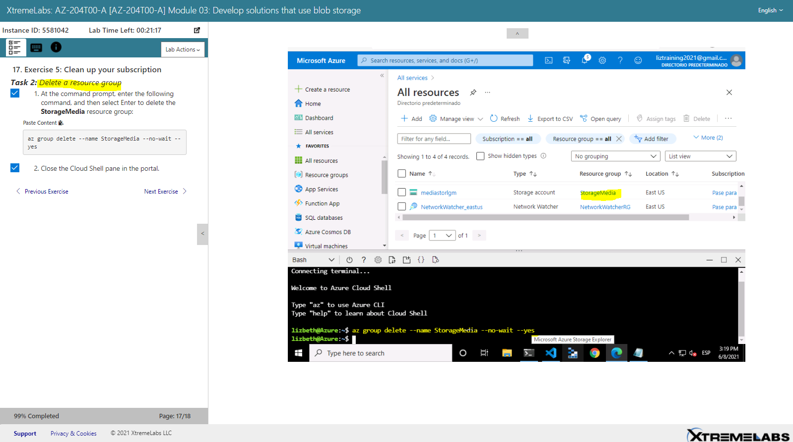

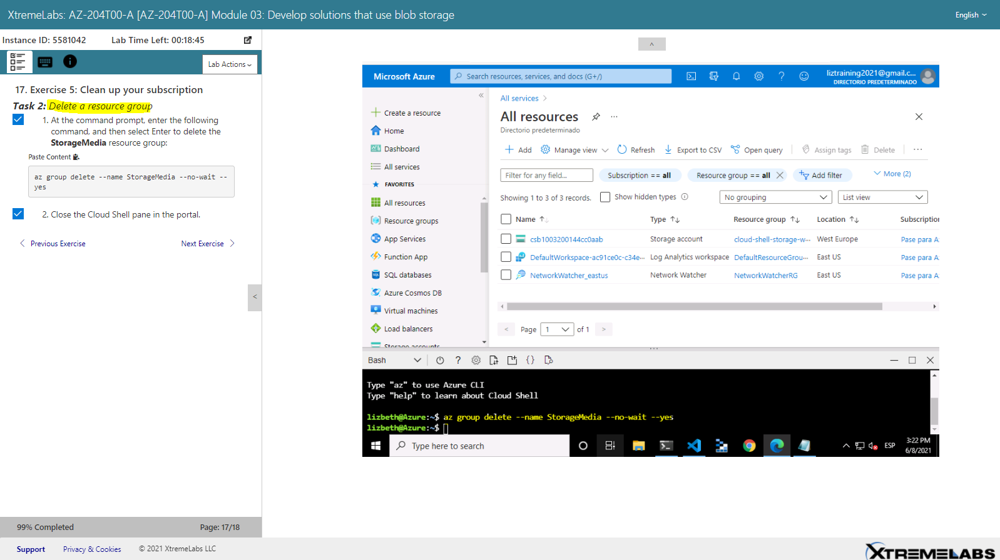

# [Volver >>>](https://github.com/liztraining2021/CFTICIFCD3820611/blob/master/ContenidoEvidenciasAZ-204.md)

