# Lab 09: Publishing and subscribing to Event Grid events
## Microsoft Azure user interface

Given the dynamic nature of Microsoft cloud tools, you might experience Azure UI changes after the development of this training content. These changes might cause the lab instructions and lab steps to not match up.

Microsoft updates this training course when the community brings needed changes to our attention; however, because cloud updates occur frequently, you might encounter UI changes before this training content updates. **If this occurs, adapt to the changes, and then work through them in the labs as needed.**


### Exercise 1: Create Azure resources

#### Task 1: Open the Azure portal

1. On the taskbar, select the **Microsoft Edge** icon.

1. In the open browser window, go to the Azure portal (<https://portal.azure.com>).

1. Enter the email address for your Microsoft account, and then select **Next**.

1. Enter the password for your Microsoft account, and then select **Sign in**.

    > **Note**: If this is your first time signing in to the Azure portal, you'll be offered a tour of the portal. Select **Get Started** to skip the tour and begin using the portal.

#### Task 2: Open Azure Cloud Shell

1. In the Azure portal, select the **Cloud Shell** icon to open a new shell instance.

    > **Note**: The **Cloud Shell** icon is represented by a greater than sign (\>) and underscore character (\_).

1. If this is your first time opening Cloud Shell using your subscription, you can use the **Welcome to Azure Cloud Shell Wizard** to configure Cloud Shell. Perform the following actions in the wizard:

    - When a dialog box prompts you to create a new storage account to begin using the shell, accept the default settings, and then select **Create storage**.

    > **Note**: Wait for Cloud Shell to finish its initial setup procedures before continuing with the lab. If you don't notice the **Cloud Shell** configuration options, this is most likely because you're using an existing subscription with this course's labs. The labs are written with the presumption that you're using a new subscription.

1. In Azure portal, at the **Cloud Shell** command prompt enter the following command, and then select Enter to get the version of the Azure Command-Line Interface (Azure CLI) tool:

    ```bash
    az --version
    ```

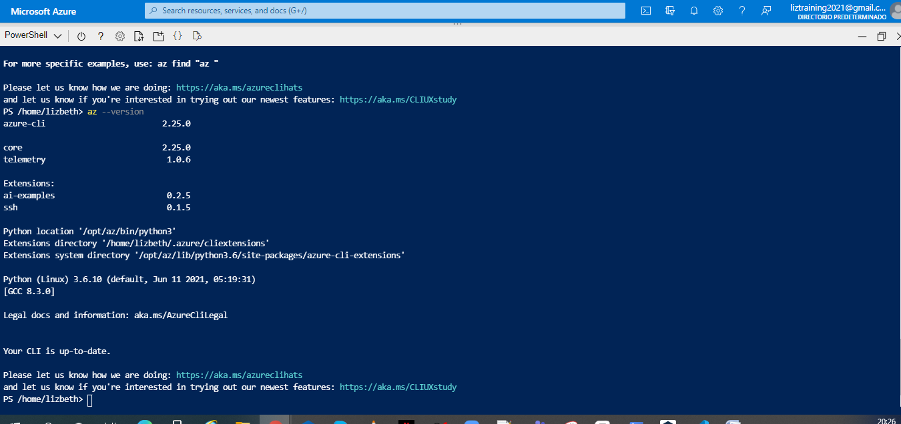

#### Task 3: View the Microsoft.EventGrid provider registration

1. At the **Cloud Shell** command prompt in the portal, perform the following actions:

    1. Enter the following command, and then select Enter to get a list of subgroups and commands at the root level of the Azure CLI:

        ```bash
        az --help
        ```

    1. Enter the following command, and then select Enter to get a list of the commands that are available for resource providers:

        ```bash
        az provider --help
        ```

    1. Enter the following command, and then select Enter to list all currently registered providers:

        ```bash
        az provider list
        ```

    1. Enter the following command, and then select Enter to list just the namespaces of the currently registered providers:

        ```bash
        az provider list --query "[].namespace"
        ```

    1. Review the list of currently registered providers. Notice that the **Microsoft.EventGrid** provider is currently included in the list of providers.

1. Close the Cloud Shell pane.

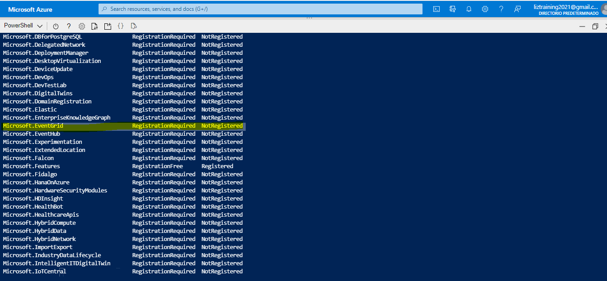

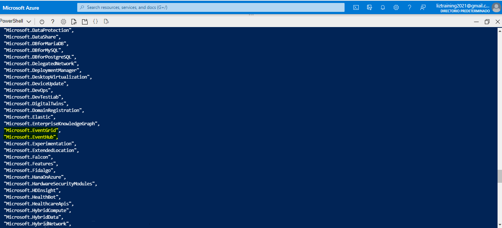

#### Task 4: Create a custom Event Grid topic

1. In the Azure portal's navigation pane, select **Create a resource**.

1. On the **New** blade, find the **Search the Marketplace** text box.

1. In the search box, enter **Event Grid Topic**, and then select Enter.

1. On the **Everything** search results blade, select the **Event Grid Topic** result.

1. On the **Event Grid Topic** blade, select **Create**.

1. On the **Create Topic** blade, perform the following actions:

    1. In the **Name** text box, enter **hrtopic*[yourname]***.

    1. In the **Resource group** section, select **Create new**, enter **PubSubEvents**, and then select **OK**.

    1. From the **Location** drop-down list, select the **(US) East US** region.

    1. From the **Event Schema** drop-down list, select **Event Grid Schema**, and then select **Create**.
  
    > **Note**: Wait for Azure to finish creating the topic before you continue with the lab. You'll receive a notification when the topic is created.

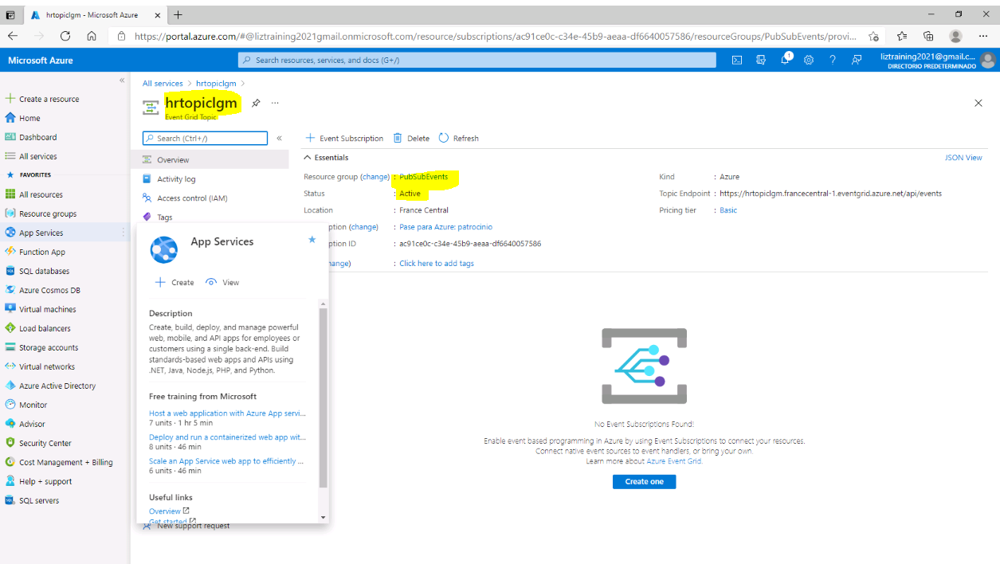

#### Task 5: Deploy the Azure Event Grid viewer to a web app

1. In the Azure portal's navigation pane, select **Create a resource**.

1. On the **New** blade, find the **Search the Marketplace** text box.

1. In the search box, enter **Web**, and then select Enter.

1. On the **Everything** search results blade, select the **Web App** result.

1. On the **Web App** blade, select **Create**.

1. On the second **Web App** blade, find the tabs on the blade, such as **Basics**.

    > **Note**: Each tab represents a step in the workflow to create a new web app. You can select **Review + Create** at any time to skip the remaining tabs.

1. On the **Basics** tab, perform the following actions:

    1. Leave the **Subscription** text box set to its default value.

    1. In the **Resource group** section, select **PubSubEvents**.

    1. In the **Name** text box, enter **eventviewer*[yourname]***.

    1. In the **Publish** section, select **Docker Container**.

    1. In the **Operating System** section, select **Linux**.

    1. From the **Region** drop-down list, select the **East US** region.

    1. In the **Linux Plan (East US)** section, select **Create new**. 

    1. In the **Name** text box, enter the value **EventPlan**, and then select **OK**.

    1. Leave the **SKU and size** section set to its default value.

    1. Select **Next: Docker**.

1. On the **Docker** tab, perform the following actions:

    1. From the **Options** drop-down list, select **Single Container**.

    1. From the **Image Source** drop-down list, select **Docker Hub**.

    1. From the **Access Type** drop-down list, select **Public**.

    1. In the **Image and tag** text box, enter **microsoftlearning/azure-event-grid-viewer:latest**.

    1. Select **Review + Create**.

1. On the **Review + Create** tab, review the options that you selected during the previous steps.

1. Select **Create** to create the web app using your specified configuration. 
  
    > **Note**: Wait for Azure to finish creating the web app before you continue with the lab. You'll receive a notification when the app is created.

#### Review

In this exercise, you created the Event Grid topic and a web app that you will use throughout the remainder of the lab.

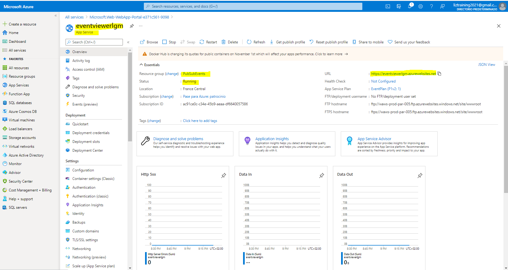

### Exercise 2: Create an Event Grid subscription

#### Task 1: Access the Event Grid Viewer web application

1. In the Azure portal's navigation pane, select **Resource groups**.

1. On the **Resource groups** blade, select the **PubSubEvents** resource group that you created earlier in this lab.

1. On the **PubSubEvents** blade, select the **eventviewer*[yourname]*** web app that you created earlier in this lab.

1. On the **App Service** blade, in the **Settings** category, select the **Properties** link.

1. In the **Properties** section, record the value of the **URL** text box. You'll use this value later in the lab.

1. Select **Overview**.

1. In the **Overview** section, select **Browse**.

1. Observe the currently running **Azure Event Grid viewer** web application. Leave this web application running for the remainder of the lab.

    > **Note**: This web application will update in real-time as events are sent to its endpoint. We will use this to monitor events throughout the lab.

1. Return to your currently open browser window that's displaying the Azure portal.

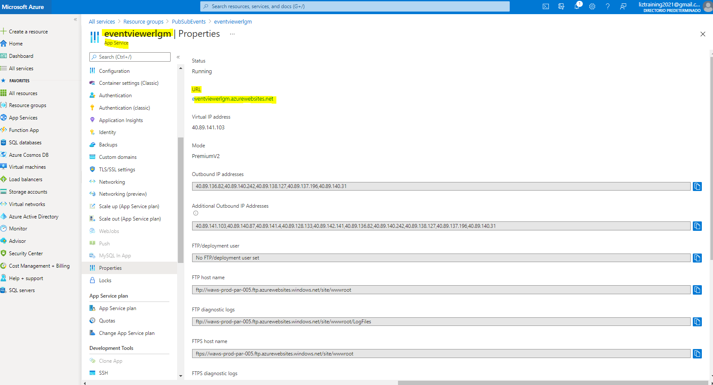

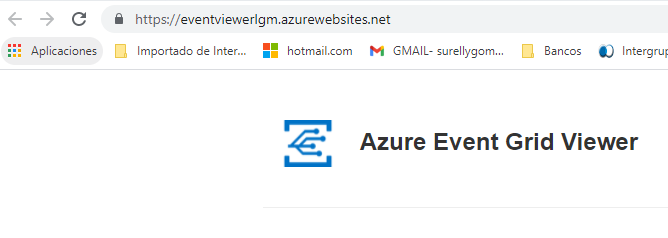

#### Task 2: Create new subscription

1. In the Azure portal's navigation pane, select **Resource groups**.

1. On the **Resource groups** blade, select the **PubSubEvents** resource group that you created earlier in this lab.

1. On the **PubSubEvents** blade, select the **hrtopic*[yourname]*** Event Grid topic that you created earlier in this lab.

1. On the **Event Grid Topic** blade, select **+ Event Subscription**.

1. On the **Create Event Subscription** blade, perform the following actions:

    1. In the **Name** text box, enter **basicsub**.

    1. In the **Event Schema** list, select **Event Grid Schema**.

    1. In the **Endpoint Type** list, select **Web Hook**.

    1. Select **Endpoint**.

    1. In the **Select Web Hook** dialog box, in the **Subscriber Endpoint** text box, enter the **Web App URL** value that you recorded earlier, ensure it uses an **https://** prefix, add the suffix **/api/updates**, and then select **Confirm Selection**.

        > **Note**: For example, if your **Web App URL** value is ``http://eventviewerstudent.azurewebsites.net/``, then your **Subscriber Endpoint** would be ``https://eventviewerstudent.azurewebsites.net/api/updates``.

    1. Select **Create**.
  
    > **Note**: Wait for Azure to finish creating the subscription before you continue with 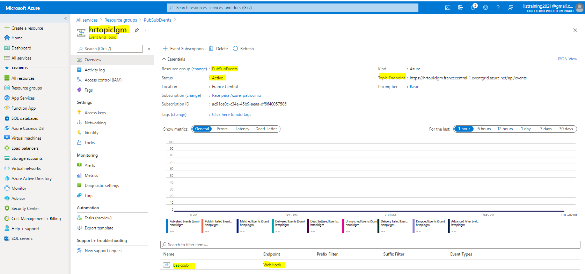
    >
    > the lab. You'll receive a notification when the subscription is created.

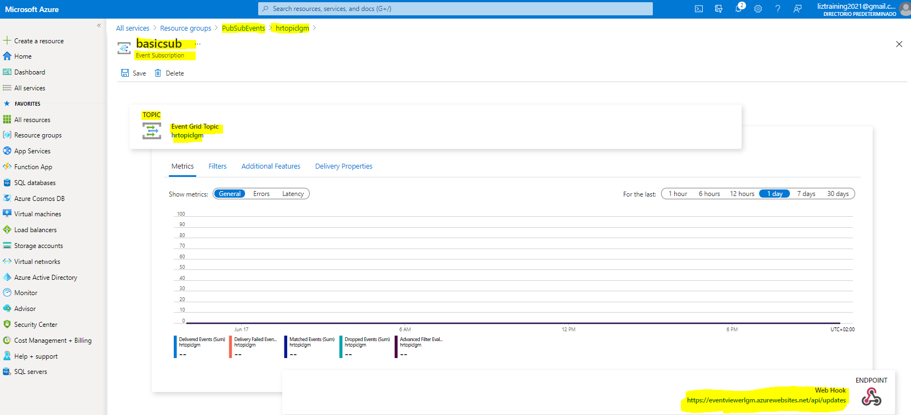

#### Task 3: Observe the subscription validation event

1. Return to the browser window displaying the **Azure Event Grid viewer** web application.

1. Review the **Microsoft.EventGrid.SubscriptionValidationEvent** event that was created as part of the subscription creation process.

1. Select the event and review its JSON content.

1. Return to your currently open browser window with the Azure portal.


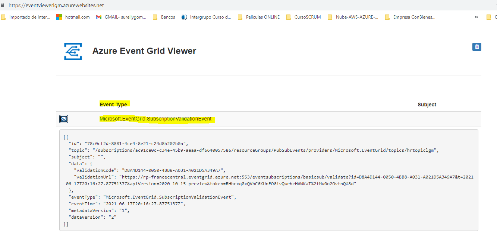

#### Task 4: Record subscription credentials

1. In the Azure portal's navigation pane, select **Resource groups**.

1. On the **Resource groups** blade, select the **PubSubEvents** resource group that you created earlier in this lab.

1. On the **PubSubEvents** blade, select the **hrtopic*[yourname]*** Event Grid topic that you created earlier in this lab.

1. On the **Event Grid Topic** blade, record the value of the **Topic Endpoint** field. You'll use this value later in the lab.

1. In the **Settings** category, select the **Access keys** link.

1. In the **Access keys** section, record the value of the **Key 1** text box. You'll use this value later in the lab.

#### Review

In this exercise, you created a new subscription, validated its registration, and then recorded the credentials required to publish a new event to the topic.

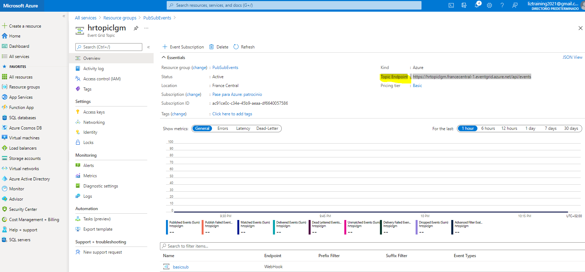

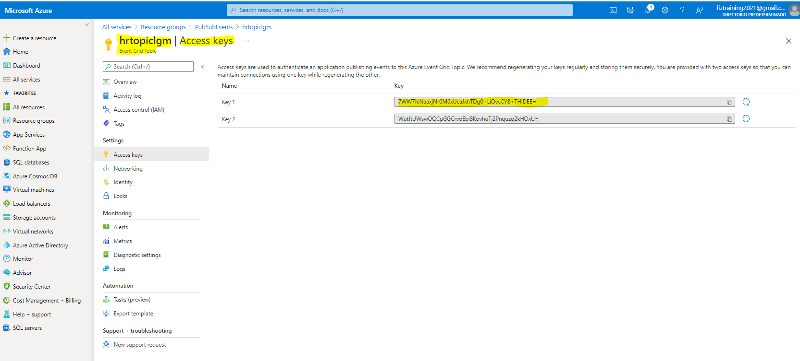

### Exercise 3: Publish Event Grid events from .NET

#### Task 1: Create a .NET project

1. On the **Start** screen, select the **Visual Studio Code** tile.

1. From the **File** menu, select **Open Folder**.

1. In the **File Explorer** window that opens, browse to **Allfiles (F):\\Allfiles\\Labs\\09\\Starter\\EventPublisher**, and then select **Select Folder**.

1. In the **Visual Studio Code** window, right-click or activate the shortcut menu for the Explorer pane, and then select **Open in Terminal**.

1. At the open command prompt, enter the following command, and then select Enter to create a new .NET project named **EventPublisher** in the current folder:

    ```powershell
    dotnet new console --name EventPublisher --output .
    ```

    > **Note**: The **dotnet new** command will create a new **console** project in a folder with the same name as the project.

1. At the command prompt, enter the following command, and then select Enter to import version 4.1.0 of **Azure.Messaging.EventGrid** from NuGet:

    ```powershell
    dotnet add package Azure.Messaging.EventGrid --version 4.1.0
    ```

    > **Note**: The **dotnet add package** command will add the **Microsoft.Azure.EventGrid** package from NuGet. For more information, go to [Azure.Messaging.EventGrid](https://www.nuget.org/packages/Azure.Messaging.EventGrid/4.1.0).

1. At the command prompt, enter the following command, and then select Enter to build the .NET web application:

    ```powershell
    dotnet build
    ```

1. Select **Kill Terminal** or the **Recycle Bin** icon to close the currently open terminal and any associated processes.

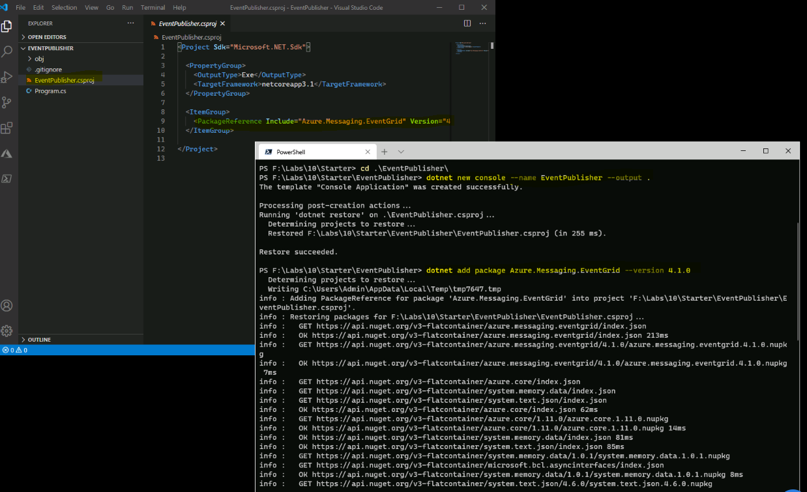

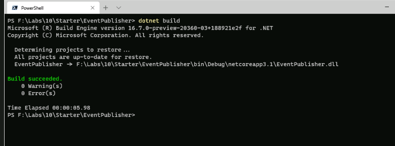

#### Task 2: Modify the Program class to connect to Event Grid

1. In the Explorer pane of the **Visual Studio Code** window, open the **Program.cs** file.

1. On the code editor tab for the **Program.cs** file, delete all the code in the existing file.

1. Add the following line of code to import the **Azure**, and **Azure.Messaging.EventGrid** namespaces from the **Azure.Messaging.EventGrid** package imported from NuGet:

    ```csharp
    using Azure;
    using Azure.Messaging.EventGrid;
    ```

1. Add the following lines of code to add **using** directives for the built-in namespaces that will be used in this file:

    ```csharp
    using System;
    using System.Threading.Tasks;
    ```

1. Enter the following code to create a new **Program** class:

    ```csharp
    public class Program
    {
    }
    ```

1. In the **Program** class, enter the following line of code to create a new string constant named **topicEndpoint**:

    ```csharp
    private const string topicEndpoint = "";
    ```

1. Update the **topicEndpoint** string constant by setting its value to the **Topic Endpoint** of the Event Grid topic that you recorded earlier in this lab.

1. In the **Program** class, enter the following line of code to create a new string constant named **topicKey**:

    ```csharp
    private const string topicKey = "";
    ```

1. Update the **topicKey** string constant by setting its value to the **Key** of the Event Grid topic that you recorded earlier in this lab.

1. In the **Program** class, enter the following code to create a new asynchronous **Main** method:

    ```csharp
    public static async Task Main(string[] args)
    {
    }
    ```

1. Observe the **Program.cs** file, which should now include the following lines of code:

    ```csharp
    using System;
    using System.Threading.Tasks;
    using Azure;
    using Azure.Messaging.EventGrid;
    
    public class Program
    {
        private const string topicEndpoint = "<topic-endpoint>";
        private const string topicKey = "<topic-key>";
        
        public static async Task Main(string[] args)
        {
        }
    }
    ```

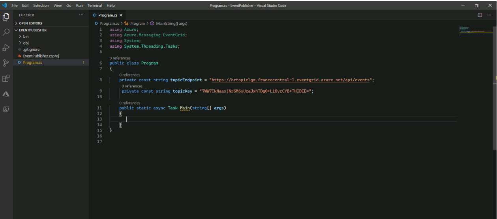

#### Task 3: Publish new events

1. In the **Main** method, perform the following actions to publish a list of events to your topic endpoint:

    1. Add the following line of code to create a new variable named **endpoint** of type **Uri**, using the **topicEndpoint** string constant as a constructor parameter:

        ```csharp
        Uri endpoint = new Uri(topicEndpoint); 
        ```

    1. Add the following line of code to create a new variable named **credential** of type **[AzureKeyCredential](https://docs.microsoft.com/dotnet/api/azure.azurekeycredential)**, using the **topicKey** string constant as a constructor parameter:

        ```csharp
        AzureKeyCredential credential = new AzureKeyCredential(topicKey);
        ```

    1. Add the following line of code to create a new variable named **client** of type **[EventGridPublisherClient](https://docs.microsoft.com/dotnet/api/azure.messaging.eventgrid.eventgridpublisherclient)**, using the **endpoint** and **credential** variables as constructor parameters:

        ```csharp
        EventGridPublisherClient client = new EventGridPublisherClient(endpoint, credential);
        ```

    1. Add the following block of code to create a new variable named **firstEvent** of type **[EventGridEvent](https://docs.microsoft.com/dotnet/api/azure.messaging.eventgrid.eventgridevent)** and populate that variable with sample data:

        ```csharp
        EventGridEvent firstEvent = new EventGridEvent(
            subject: $"New Employee: Alba Sutton",
            eventType: "Employees.Registration.New",
            dataVersion: "1.0",
            data: new
            {
                FullName = "Alba Sutton",
                Address = "4567 Pine Avenue, Edison, WA 97202"
            }
        );
        ```

    1. Add the following block of code to create a new variable named **secondEvent** of type **[EventGridEvent](https://docs.microsoft.com/dotnet/api/azure.messaging.eventgrid.eventgridevent)** and populate that variable with sample data:

        ```csharp
        EventGridEvent secondEvent = new EventGridEvent(
            subject: $"New Employee: Alexandre Doyon",
            eventType: "Employees.Registration.New",
            dataVersion: "1.0",
            data: new
            {
                FullName = "Alexandre Doyon",
                Address = "456 College Street, Bow, WA 98107"
            }
        );
        ```

    1. Add the following line of code to asynchronously invoke the **[EventGridPublisherClient.SendEventAsync](https://docs.microsoft.com/dotnet/api/azure.messaging.eventgrid.eventgridpublisherclient.sendeventasync)** method using the **firstEvent** variable as a parameter:

        ```csharp
        await client.SendEventAsync(firstEvent);
        ```

    1. Add the following line of code to render the **"First event published"** message to the console:

        ```csharp
        Console.WriteLine("First event published");
        ```

    1. Add the following line of code to asynchronously invoke the **[EventGridPublisherClient.SendEventAsync](https://docs.microsoft.com/dotnet/api/azure.messaging.eventgrid.eventgridpublisherclient.sendeventasync)** method using the **secondEvent** variable as a parameter:

        ```csharp
        await client.SendEventAsync(secondEvent);
        ```

    1. Add the following line of code to render the **"Second event published"** message to the console:

        ```csharp
        Console.WriteLine("Second event published");
        ```

1. Review the **Main** method, which should now include:

    ```csharp
    public static async Task Main(string[] args)
    {
        Uri endpoint = new Uri(topicEndpoint);
        AzureKeyCredential credential = new AzureKeyCredential(topicKey);
        EventGridPublisherClient client = new EventGridPublisherClient(endpoint, credential);
        
        EventGridEvent firstEvent = new EventGridEvent(
            subject: $"New Employee: Alba Sutton",
            eventType: "Employees.Registration.New",
            dataVersion: "1.0",
            data: new
            {
                FullName = "Alba Sutton",
                Address = "4567 Pine Avenue, Edison, WA 97202"
            }
        );

        EventGridEvent secondEvent = new EventGridEvent(
            subject: $"New Employee: Alexandre Doyon",
            eventType: "Employees.Registration.New",
            dataVersion: "1.0",
            data: new
            {
                FullName = "Alexandre Doyon",
                Address = "456 College Street, Bow, WA 98107"
            }
        );

        await client.SendEventAsync(firstEvent);
        Console.WriteLine("First event published");

        await client.SendEventAsync(secondEvent);
        Console.WriteLine("Second event published");
    }
    ```

1. Save the **Program.cs** file.

1. In the **Visual Studio Code** window, right-click or activate the shortcut menu for the Explorer pane, and then select **Open in Terminal**.

1. At the open command prompt, enter the following command, and then select Enter to run the .NET web application:

    ```powershell
    dotnet run
    ```

    > **Note**: If there are any build errors, review the **Program.cs** file in the **Allfiles (F):\\Allfiles\\Labs\\09\\Solution\\EventPublisher** folder.

1. Observe the success message output from the currently running console application.

1. Select **Kill Terminal** or the **Recycle Bin** icon to close the currently open terminal and any associated processes.

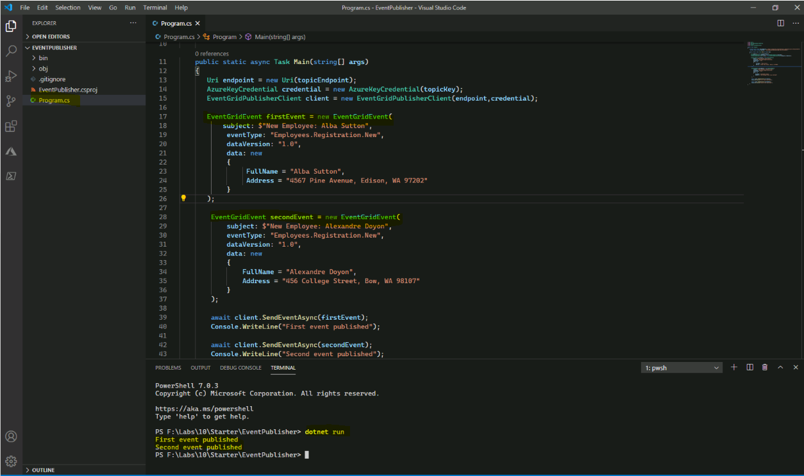

#### Task 4: Observe published events

1. Return to the browser window with the **Azure Event Grid viewer** web application.

1. Review the **Employees.Registration.New** events that were created by your console application.

1. Select any of the events and review its JSON content.

1. Return to the Azure portal.

#### Review

In this exercise, you published new events to your Event Grid topic using a .NET console application.

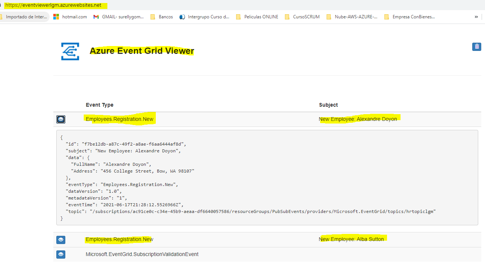

### Exercise 4: Clean up your subscription

#### Task 1: Open Azure Cloud Shell

1. In Azure portal, select the **Cloud Shell** icon to open a new shell instance.

    > **Note**: The **Cloud Shell** icon is represented by a greater than sign (\>) and underscore character (\_).

1. If this is your first time opening Cloud Shell using your subscription, you can use the **Welcome to Azure Cloud Shell Wizard** to configure Cloud Shell for first-time usage. Perform the following actions in the wizard:

    1. A dialog box prompts you to configure the shell. Select **Bash**, review the selected subscription, and then select **Create storage**.

    > **Note**: Wait for Cloud Shell to finish its initial setup procedures before moving forward with the lab. If you don't notice the Cloud Shell configuration options, this is most likely because you're using an existing subscription with this course's labs. The labs are written with the presumption that you're using a new subscription.

#### Task 2: Delete resource groups

1. Enter the following command, and then select Enter to delete the **PubSubEvents** resource group:

    ```bash
    az group delete --name PubSubEvents --no-wait --yes
    ```

1. Close the Cloud Shell pane in the portal.

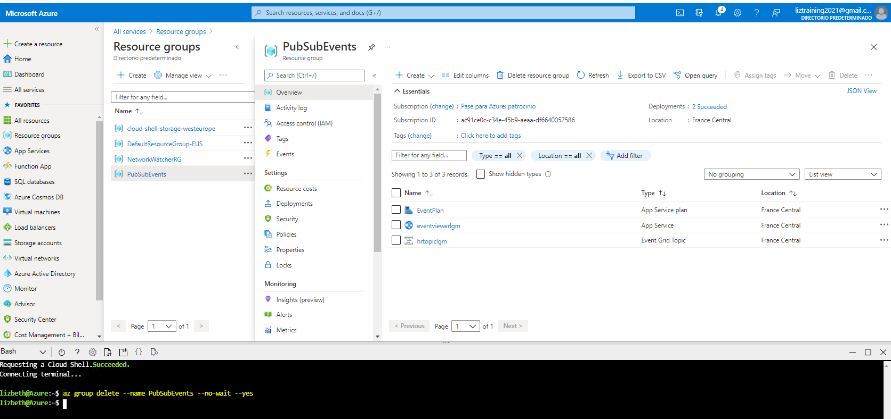

#### Task 3: Close the active applications

1. Close the currently running Microsoft Edge application.

1. Close the currently running Visual Studio Code application.

#### Review

In this exercise, you cleaned up your subscription by removing the resource groups used in this lab.


# [Volver >>>](https://github.com/liztraining2021/CFTICIFCD3820611/blob/master/ContenidoEvidenciasAZ-204.md)

